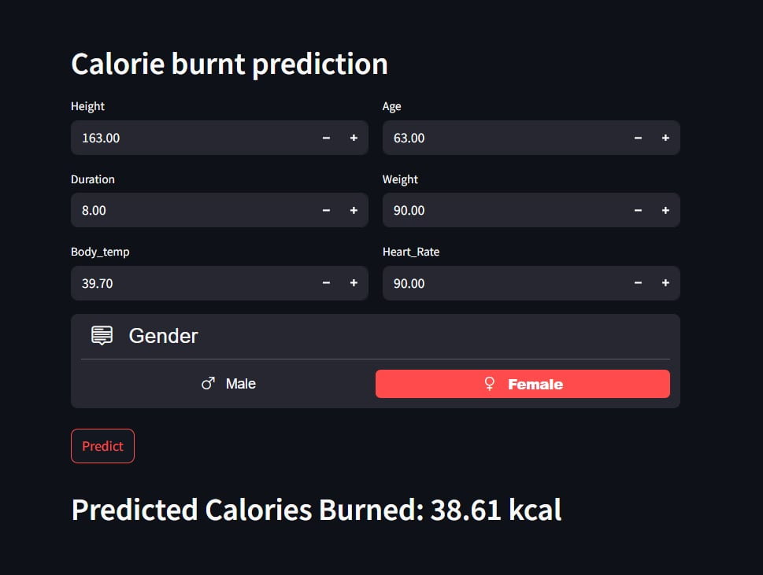

# Predict_Calorie_Expenditure

# Overview
The primary objective of this project is to estimate the number of calories burned during exercise sessions. We utilize advanced machine learning techniques to construct models that precisely predict calorie expenditure based on diverse user features. Moreover, we use dataset from [kaggle competition](https://www.kaggle.com/competitions/playground-series-s5e5/overview).

# Files Included
* train.csv: Dataset containing exercise-related information and calories burned to train a model <br />
* test.csv: Dataset containing exercise-related information to predict <br />
* predict_calorie.py: Python script to predict calories burned <br />
* predict_calorie.ipynb: Jupyter notebook to visualize insights

# Steps
* Data Loading
* Exploratory Data Analysis (EDA)
* Data Preprocessing
* Feature Engineering
* Model Traning
* Evaluation

# Running streamlit file
After downloading and saving the streamlit file (predict_calorie.py) into a certain directory, you have to open Command Prompt. In your command prompt change the directory to the directory where the streamlit file is saved and then type:
```
streamlit run predict_calorie.py
```
# Conclusion
This project highlights the effective utilization of machine learning models in predicting calories burned during work out. 
